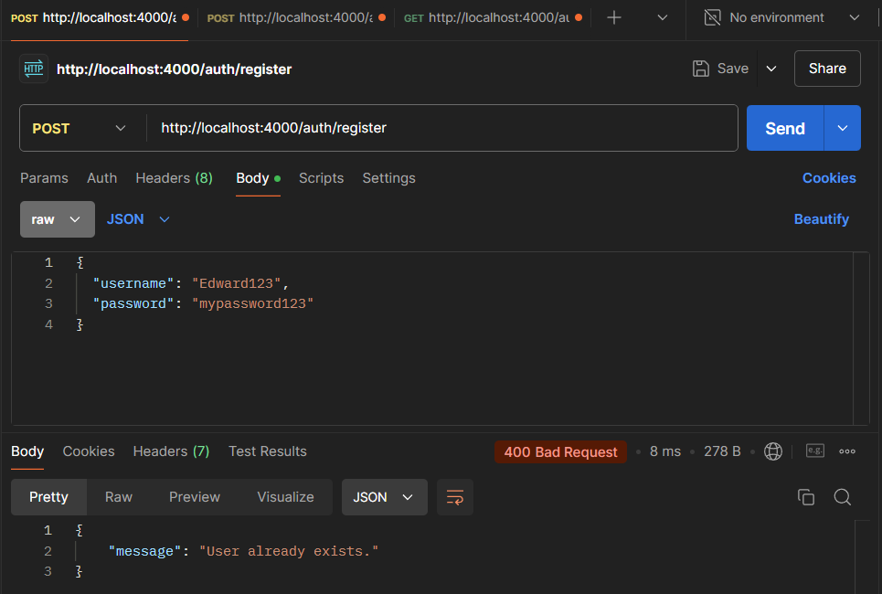
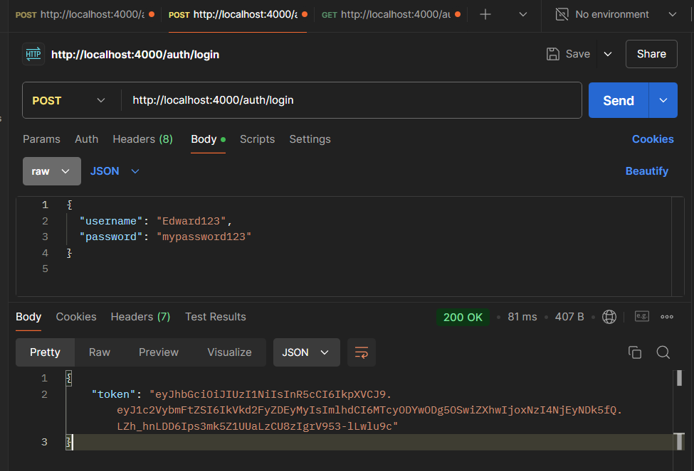
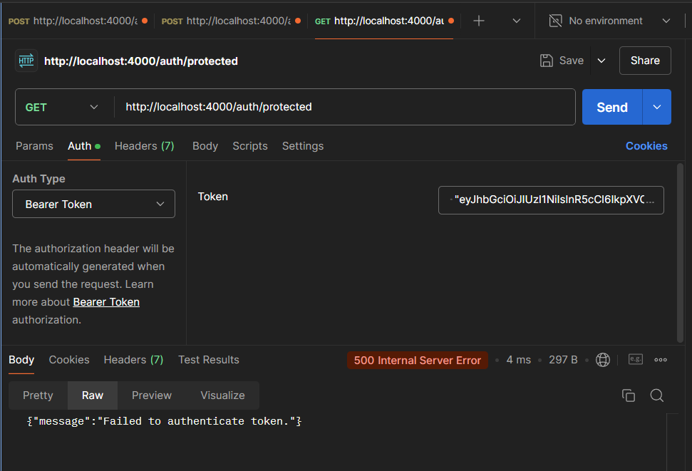
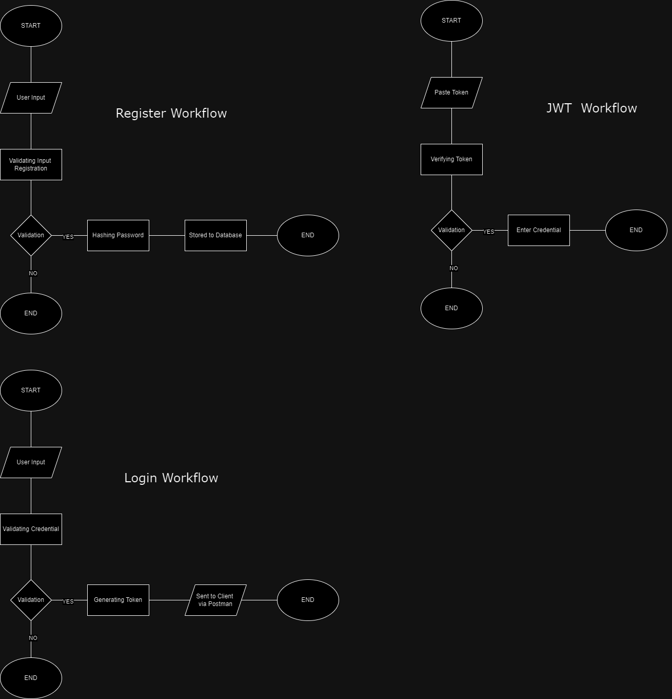

# SDLC Security Features Project

Name : Edward Christopher Sugianto (12102006)

This project is an assignment for the **Software Development Life Cycle (SDLC)** course. It demonstrates the implementation of key security features in a simple Node.js web application.

## Features
- **User Registration**: Allows users to register with secure password storage using bcrypt.
- **User Login**: Users can log in, and upon successful login, a JSON Web Token (JWT) is generated.
- **Protected Routes**: Access to protected routes is restricted to users with a valid JWT.
- **SQL Injection Prevention**: Queries are handled using parameterized statements to avoid SQL injection attacks.

## Installation
1. Clone the repository:
   ```bash
   git clone https://github.com/EdwardChristopher/SDLC_Security_Features.git

## Disclaimer

This assignment was completed through research using various resources, **including AI tools, and by applying code learned both in class and outside of class.** The project combines AI-generated insights with practical implementation of security features learned during the course.

## Usage

Use **Postman or any API testing tool** to interact with the API.

**Registration:**
- Open Postman (Use POST)
- http://localhost:4000/auth/register

```bash
{
  "username": "exampleuser",
  "password": "password123"
}
```

**Login:**
- Open Postman (Use POST)
- http://localhost:4000/auth/login

```bash
{
  "username": "exampleuser",
  "password": "password123"
}
```

**JWT Protection:**
- Use Token that given after login succeed
- Paste into bearer token that available in Postman


## Appendix
REGISTER


LOGIN


JWT PROTECTION


WORKFL0W DIAGRAM
